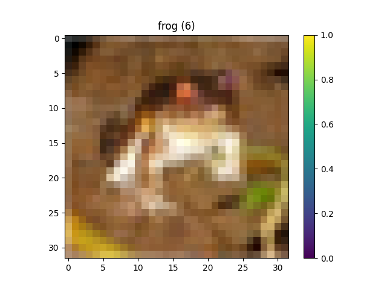

This blog is going to cover the [convolutional neural network](https://www.tensorflow.org/tutorials/images/cnn) (CNN) tutorial provided by Tensorflow. The CNN is going to be used to classify [CIFAR-10](https://www.cs.toronto.edu/%7Ekriz/cifar.html) images, which is a dataset consisting of 10 classes: airplane, automobile, bird, cat, deer, dog, frog, horse, ship, and truck. There are 60000 (32x32 color) images, 6000 for each class, 50000 training images, and 10000 test images. 

You will need the following dependencies installed:

* Tensorflow
* Matplotlib

As always, let's start by building the base of our class.

```Python
import matplotlib.pyplot as plt
import tensorflow as tf
from tensorflow.keras import datasets, layers, models

class CifarCNN(object):
    def __init__(self):
        self.classes = ['airplane', 'automobile', 'bird', 'cat', 'deer', 'dog', 'frog', 'horse', 'ship', 'truck']        
        (self.train_imgs, self.train_labels), (self.test_imgs, self.test_labels) = datasets.cifar10.load_data()
```

No need for an `obtain_data` method, since [tensorflow.keras.datasets](https://www.tensorflow.org/api_docs/python/tf/keras/datasets) provides a `cifar10` module, which returns a tuple of numpy arrays `(x_train, y_train), (x_test, y_test)`. Since we are only working with 10 classes, I am going to leave the hard coded `self.classes` value.

The first method we are going to add is `explore_data`. I diverged a bit from the tutorial, mostly because I want to get into a good habit of what I should be exploring when it comes to the data (especially with data that isn't already prepared).

```Python
    def explore_data(self):
        print(f'\n{len(self.train_imgs)} training examples ...')
        print(f'Training image shape: {self.train_imgs[0].shape}')
        print(f'Training labels: {self.train_labels}')
        print(f'Training labels type: {type(self.train_labels)}')
        
        print(f'\n{len(self.test_imgs)} test examples ...')
        print(f'Test image shape: {self.test_imgs[0].shape}')
        print(f'Test labels: {self.test_labels}')
        print(f'Test labels type: {type(self.test_labels)}')
        
        plt.figure(figsize=(10, 10))
        for i in range(25):
            plt.subplot(5, 5, i+1)
            plt.xticks([])
            plt.yticks([])
            plt.grid(False)
            plt.imshow(self.train_imgs[i], cmap=plt.cm.binary)
            plt.xlabel(self.classes[self.train_labels[i][0]])
        plt.show()
```

The first thing we do in this method is inspect the number of training/test examples, the shape of the training/test example images, the training/test labels, and the datatype used for the training/test labels. The reason for checking the datatype is the same reason as above, to get into a habit of understanding what I am working with. After inspecting the images and labels, we visualize 25 of the training images with their corresponding labels.

The output:

```
50000 training examples ...
Train image shape: (32, 32, 3)
Train labels: [[6]
 [9]
 [9]
 ...
 [9]
 [1]
 [1]]
Training labels type: <class 'numpy.ndarray'>

10000 test examples ...
Test image shape: (32, 32, 3)
Test labels: [[3]
 [8]
 [8]
 ...
 [5]
 [1]
 [7]]
Test labels type: <class 'numpy.ndarray'>
```


\

The next method we are adding is `preprocess_data`. In this method we are just normalizing the images from a `[0, 255]` range to a `[0, 1]` range. I added an extra step, which is to visualize the first training image, to ensure that the images were normalized properly.

```Python
    def preprocess_data(self):
        self.train_imgs = self.train_imgs / 255.0
        self.test_imgs = self.test_imgs / 255.0

        plt.figure()
        plt.title(f'{self.classes[self.train_labels[0][0]]} ({self.train_labels[0][0]})')
        plt.imshow(self.train_imgs[0])
        plt.colorbar()
        plt.grid(False)
        plt.show()
```

The output:



\

Next, to add the `build_model` method. 

```Python
    def build_model(self):
        model = models.Sequential([
            layers.Conv2D(32, (3, 3), activation='relu', input_shape=(32, 32, 3)),
            layers.MaxPool2D((2, 2)),
            layers.Conv2D(64, (3, 3), activation='relu'),
            layers.MaxPool2D((2, 2)),
            layers.Conv2D(64, (3, 3), activation='relu'),
            layers.Flatten(),
            layers.Dense(64, activation='relu'),
            layers.Dense(10)
        ])

        model.summary()

        model.compile(
            optimizer='adam',
            loss=tf.keras.losses.SparseCategoricalCrossentropy(from_logits=True),
            metrics=['accuracy']
        )

        return model
```

The model we are building consists of seven layers. The first layer is a `Conv2D` layer with 32 filters, a 3x3 kernel size, ReLU for the activation function, and defining the input shape as a 32x32 image with 3 channels (RGB). I found a really good gif that visually describes what a 2D convolution looks like.


[[source]](https://stackoverflow.com/a/50317223)

The second layers is a `MaxPool2D` layer with a pool size of 2x2. Max-pooling just down-samples an input. The following is a nice visual of that process and what a real example would look like.


 

[[source]](https://computersciencewiki.org/index.php/Max-pooling_/_Pooling)

The third and fifth layers are the same as the first, except for the filters being 64 rather than 32, and specification of an input shape (which is only needed for the first layer). The fourth layer is the same as the second. The sixth layer (`Flatten`), transforms the three-dimensional array to a one-dimensional one, since dense layers take vectors as inputs (one-dimensional arrays). The seventh layer is a `Dense` layer that has 64 units (neurons), and uses ReLU as the activation function. The eighth and final layer is another dense layer that has 10 units (one unit for each of the 10 CIFAR classes).

The model summary:

```
Model: "sequential"
_________________________________________________________________
Layer (type)                 Output Shape              Param #
=================================================================
conv2d (Conv2D)              (None, 30, 30, 32)        896
_________________________________________________________________
max_pooling2d (MaxPooling2D) (None, 15, 15, 32)        0
_________________________________________________________________
conv2d_1 (Conv2D)            (None, 13, 13, 64)        18496
_________________________________________________________________
max_pooling2d_1 (MaxPooling2 (None, 6, 6, 64)          0
_________________________________________________________________
conv2d_2 (Conv2D)            (None, 4, 4, 64)          36928
_________________________________________________________________
flatten (Flatten)            (None, 1024)              0
_________________________________________________________________
dense (Dense)                (None, 64)                65600
_________________________________________________________________
dense_1 (Dense)              (None, 10)                650
=================================================================
Total params: 122,570
Trainable params: 122,570
Non-trainable params: 0
```

The last operation performed in this method is `model.compile`. For the optimizer we are using adam, for the loss we are using [SparseCategoricalCrossentropy](https://www.tensorflow.org/api_docs/python/tf/keras/losses/SparseCategoricalCrossentropy), and for the metrics we are using accuracy. For a more in-depth explanation of what those are please refer to my [basic image classification blog](/programming/python/tensorflow/basic-image-classification).

\

The next method is `train_model`. Not much happening in this method, just using the `fit()` method to train the model on our training images, for the value of `self.epochs`, and using the test images/labels to evaluate the loss and accuracy of the model.

```Python
    def train_model(self):
        return self.model.fit(
            self.train_imgs,
            self.train_labels,
            epochs=self.epochs,
            validation_data=(self.test_imgs, self.test_labels)
        )
```

The output:

```
Epoch 1/10
1563/1563 [==============================] - 36s 23ms/step - loss: 1.5464 - accuracy: 0.4367 - val_loss: 1.3381 - val_accuracy: 0.5181
Epoch 2/10
1563/1563 [==============================] - 34s 22ms/step - loss: 1.1933 - accuracy: 0.5754 - val_loss: 1.1025 - val_accuracy: 0.6065
Epoch 3/10
1563/1563 [==============================] - 34s 22ms/step - loss: 1.0338 - accuracy: 0.6354 - val_loss: 0.9951 - val_accuracy: 0.6444
Epoch 4/10
1563/1563 [==============================] - 34s 22ms/step - loss: 0.9402 - accuracy: 0.6699 - val_loss: 0.9401 - val_accuracy: 0.6669
Epoch 5/10
1563/1563 [==============================] - 34s 22ms/step - loss: 0.8648 - accuracy: 0.6964 - val_loss: 0.9229 - val_accuracy: 0.6699
Epoch 6/10
1563/1563 [==============================] - 34s 22ms/step - loss: 0.8076 - accuracy: 0.7154 - val_loss: 0.8983 - val_accuracy: 0.6958
Epoch 7/10
1563/1563 [==============================] - 34s 22ms/step - loss: 0.7651 - accuracy: 0.7338 - val_loss: 0.8623 - val_accuracy: 0.7026
Epoch 8/10
1563/1563 [==============================] - 34s 22ms/step - loss: 0.7223 - accuracy: 0.7475 - val_loss: 0.8618 - val_accuracy: 0.7017
Epoch 9/10
1563/1563 [==============================] - 34s 22ms/step - loss: 0.6865 - accuracy: 0.7571 - val_loss: 0.8845 - val_accuracy: 0.6932
Epoch 10/10
1563/1563 [==============================] - 34s 22ms/step - loss: 0.6526 - accuracy: 0.7720 - val_loss: 0.8662 - val_accuracy: 0.7080
313/313 - 2s - loss: 0.8662 - accuracy: 0.7080
```

\

From `train_model` we are returning the history object, which we will be using in the next method: `evaluate_model`. This method is checking the loss and accuracy returned from `evaluate()`, then we are plotting the accuracy and validation accuracy values.

```Python
    def evaluate_model(self):
        test_loss, test_acc = self.model.evaluate(self.test_imgs, self.test_labels, verbose=2)
        print(f'Loss: {test_loss}')
        print(f'Accuracy: {test_acc}')

        plt.plot(self.history.history['accuracy'], label='accuracy')
        plt.plot(self.history.history['val_accuracy'], label='val_accuracy')
        plt.xlabel('Epoch')
        plt.ylabel('Accuracy')
        plt.ylim([0.5, 1])
        plt.legend(loc='lower right')
        plt.show()
```

The output:

```
Loss: 0.8582513928413391
Accuracy: 0.7103999853134155
```


\

This is where the tutorial ends, but I am taking it a step further by adding a `make_predictions` method to see how the model performs. I will be re-using the `make_predictions` code from [basic image classification](/programming/python/tensorflow/basic-image-classification). Please refer to the basic image classification blog for a more detailed explanation of the code below.

```Python
def plot_img(self, prediction, actual_label, img):
        plt.grid(False)
        plt.xticks([])
        plt.yticks([])

        plt.imshow(img, cmap=plt.cm.binary)

        predicted_label = np.argmax(prediction)
        if predicted_label == actual_label:
            color = 'blue'
        else:
            color = 'red'

        predicted_class = self.classes[predicted_label]
        confidence = 100*np.max(prediction)
        actual_class = self.classes[actual_label]

        plt.xlabel(f'{predicted_class} {confidence :2.0f}% ({actual_class})', color=color)

    def plot_predictions(self, prediction, actual_label):
        plt.grid(False)
        plt.xticks(range(10))
        plt.yticks([])
        thisplot = plt.bar(range(10), prediction, color="#777777")
        plt.ylim([0, 1])
        predicted_label = np.argmax(prediction)

        thisplot[predicted_label].set_color('red')
        thisplot[actual_label].set_color('blue')

    def make_prediction(self):
        prob_model = keras.Sequential([
            self.model,
            layers.Softmax()
        ])

        predictions = prob_model.predict(self.test_imgs)

        num_rows = 5
        num_cols = 3
        num_images = num_rows*num_cols
        plt.figure(figsize=(2*2*num_cols, 2*num_rows))
        for i in range(num_images):
            plt.subplot(num_rows, 2*num_cols, 2*i+1)
            prediction, actual_label, img = predictions[i], self.test_labels[i][0], self.test_imgs[i]
            self.plot_img(prediction, actual_label, img)
            plt.subplot(num_rows, 2*num_cols, 2*i+2)
            self.plot_predictions(prediction, actual_label)
        plt.tight_layout()
        plt.show()
```

The output:


As we can see the model did quite well!